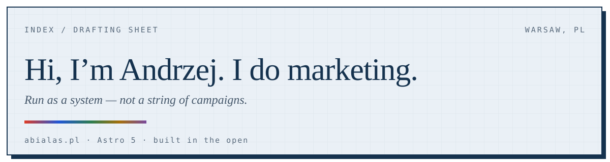

<div align="center">
  
</div>

# abialas.pl

[](https://github.com/risukisu/abialas.pl/actions/workflows/deploy.yml)

The personal site of **Andrzej Białaś** — live at **[abialas.pl](https://abialas.pl)**.

Marketers rarely have a body of work you can inspect. Developers get a GitHub profile; marketers get a slide deck. This repo is my answer: the site, its design system, its tests, and its history are all public. The homepage is a nexus of what I publish and what I build — including a live GitHub contribution graph, because "show your work" should be literal.

## What's Inside

- **The nexus homepage** — Follow (newsletter · LinkedIn · blog), Building (contribution graph + product tiles), and the hire-focused room at [/work](https://abialas.pl/work) with career outcomes in problem → approach → result form.
- **Essays at [/writing](https://abialas.pl/writing)** — a flat archive with series filtering. Essays ship when they're ready, not on a schedule, so the shelf may look sparse. That's honesty, not neglect.
- **The guest-sticker rule** — every external tile wears its *own* brand kit: borders, corner radius, type register, palette. House style ends at the tile border, and the hex values stay scoped inside each component. A newsletter tile should look like the newsletter, not like this site.
- **A color system with teeth** — five room hues in one registry (`src/data/hues.ts`), mirrored to CSS tokens, with a unit test that fails the build if any hue drops below WCAG AA or the mirror drifts.

## How It's Built

| | |
|---|---|
| Framework | [Astro 5](https://astro.build), fully static output |
| Styling | Tailwind CSS v4 + hand-written component CSS |
| Type | Newsreader · Geist · Geist Mono, plus Unbounded and Anton for brand tiles — all self-hosted, zero external requests |
| Tests | Vitest (hue/WCAG gate, content schema, JSON-LD) · Playwright (e2e) |
| Deploys | GitHub Actions → GitHub Pages |

One build-time detail worth stealing: the contribution graph is fetched during the build over `node:https` and frozen into the deploy — no client-side API calls, no loading spinner, and the fallback renders a plain link if the API is ever unreachable. The build fails loudly rather than shipping quietly broken.

## Run It

```bash
npm install
npm run dev        # localhost:4321
npm run test:unit  # vitest — includes the WCAG hue gate
npm run test:e2e   # playwright end-to-end suite
npm run build      # static site into dist/
```

The e2e specs are draft-aware: while no essay is published, the archive tests assert the empty state and the filter tests skip themselves — they re-arm automatically at first publish.

## Credits

- Pixel fox on the SkillCraft tile adapted from [Elthen's 2D Pixel Art Fox Sprites](https://elthen.itch.io/2d-pixel-art-fox-sprites) — free for commercial use; the graduation cap is ours. Tip the artist.
- Fonts self-hosted via [Fontsource](https://fontsource.org) (OFL licenses).

---

<div align="center">made with 🩵 by <a href="https://risu.pl">risu</a></div>
